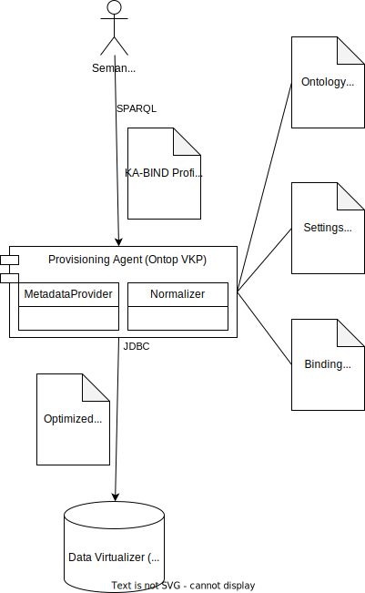

<!--
 * Copyright (c) 2022,2024 Contributors to the Eclipse Foundation
 *
 * See the NOTICE file(s) distributed with this work for additional
 * information regarding copyright ownership.
 *
 * This program and the accompanying materials are made available under the
 * terms of the Apache License, Version 2.0 which is available at
 * https://www.apache.org/licenses/LICENSE-2.0.
 *
 * Unless required by applicable law or agreed to in writing, software
 * distributed under the License is distributed on an "AS IS" BASIS, WITHOUT
 * WARRANTIES OR CONDITIONS OF ANY KIND, either express or implied. See the
 * License for the specific language governing permissions and limitations
 * under the License.
 *
 * SPDX-License-Identifier: Apache-2.0

-->

# Tractus-X Knowledge Agents Reference Implementation (KA-RI) Documentation 

In the Knowledge Agent Architecture, an Agent is any component which speaks and/or enacts a Semantic Web protocol, such as SPARQL. So agents share a common [Open Api Specifaction](openapi.json) of which they implement a particular profile, i.e., a sub-protocol.

Binding Agents are the intermediate layer between the dataspace (represented by the Matchmaking Agent that is connected to any Agent-Enabled Application and/or the Agent-Enabled Connector) and your business data & functions.

Hereby, binding (sometimes also called: bridging) means that we do not redundantly extract and transform the underlying business data, but rather we translate between the different protocols.

In contrast to the Matchmaking Agent which can delegate its work to other Agents in the Network (and it should because by itself it only carries meta-data) the binding agents are restricted to a subset of the full SPARQL protocol called the KA-BIND profile. KA-BIND can be efficiently and safely translated especially because its inference is only polynomially complex and decidable.

The binding agent layer will not cache any data for security purposes. We hence recommend not exposing your data sources and/or API resources directly. Instead we propose to use data virtualizers, such as Dremio and Databricks, and API virtualizers/gateways to introduce another level of scalability and security.

For development purposes, the binding agents can host multiple graphs, i.e. data schemas and/or APIs. However for security purposes, we recommend to employ one agent instance per schema/API.

## Provisioning Agent

The [Provisioning Agent (KA-PROV)](../provisioning) binds typical SQL-based backend data sources to SPARQL. It translates SPARQL queries into SQL queries.

* Provisioning Agent in [Drawio](ProvisioningOntop.drawio) [Svg](ProvisioningOntop.drawio.svg)

## Remoting Agent

The [Remoting Agent (KA-RMT)](../remoting) which binds typical REST services to SPARQL. Due to the nature of functional API calls, the graphs and also the SPARQL constructs are a little more restricted. We call this the KA-BIND-F profile.

* Remoting Agent in [Drawio](RemotingRDF4J.drawio) [Svg](RemotingRDF4J.drawio.svg)

## Conforming Agent

The [Conforming Agent (KA-CONF)](conforming) is not a real binding agent, but it 
can play the role of any other Agent in the Knowledge Agent architecture (Matchmaking Agent, Binding Agent, EDC Transfer) by testing the conformity of surrounding components (and the various KA-SPARQL profiles). The conforming agent contains no real business data (only reference sample data) and needs no connection to any backend service.

## NOTICE

This work is licensed under the [Apache-2.0](https://www.apache.org/licenses/LICENSE-2.0).

- SPDX-License-Identifier: Apache-2.0
- SPDX-FileCopyrightText: 2022,2023 T-Systems International GmbH
- SPDX-FileCopyrightText: 2022,2023 Contributors to the Eclipse Foundation
- Source URL: https://github.com/eclipse-tractusx/knowledge-agents
